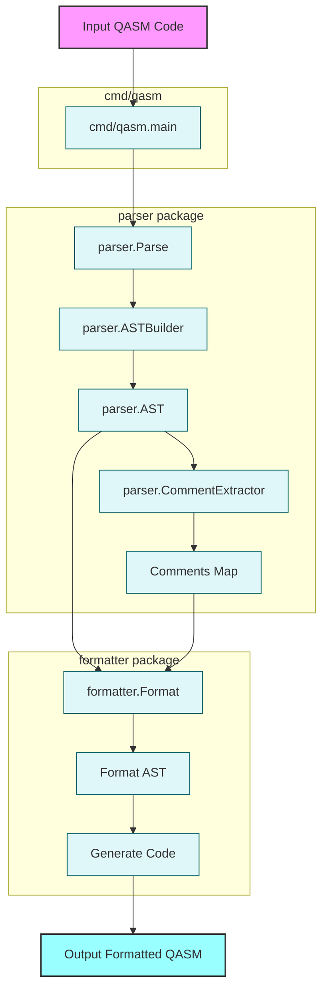

# QASM Tools


[](https://goreportcard.com/report/github.com/orangekame3/qasmtools)
[](https://opensource.org/license/apache-2-0/)

`qasmtools` is a command-line interface (CLI) tool written in Go for parsing and formatting OpenQASM 3.0 files. It provides functionalities to process QASM files, making them more readable and consistent.

## Features

* **QASM 3.0 Parsing**: Parses OpenQASM 3.0 files into an Abstract Syntax Tree (AST).
* **QASM 3.0 Formatting**: Formats QASM 3.0 files to adhere to a consistent style.

## Installation

To build `qasmtools` from source, ensure you have Go installed (version 1.16 or higher recommended).

1. Clone the repository:

    ```bash
    git clone https://github.com/orangekame3/qasmtools.git
    cd qasmtools
    ```

2. Build the executable:

    ```bash
    go build -o qasm ./cmd/qasm
    ```

    This will create an executable named `qasm` in the current directory.

## Usage

The `qasm` executable provides two main commands: `fmt` for formatting and `parse` for parsing QASM files.

### Formatting QASM Files

To format a QASM file:

```bash
qasm fmt [files...]
```

Options:

- `-w, --write`: Write result to (source) file instead of stdout
- `--check`: Check if files are formatted without modifying them
- `-i, --indent`: Set indentation size (default: 2)
- `-n, --newline`: Ensure files end with a newline (default: true)
- `-v, --verbose`: Enable verbose output
- `--diff`: Display diffs instead of rewriting files

Examples:

```bash
# Format a file and print to stdout
qasm fmt input.qasm

# Format multiple files in-place
qasm fmt -w file1.qasm file2.qasm

# Check if files are properly formatted
qasm fmt --check *.qasm

# Format with custom indentation
qasm fmt -i 4 input.qasm
```

### Parsing QASM Files

To parse and validate a QASM file:

```bash
qasm parse <file>
```

Example:

```bash
qasm parse input.qasm
```

## Project Structure

* `cmd/qasm/`: Contains the main entry point and CLI implementation
* `parser/`: Handles the parsing of QASM 3.0 files and AST generation
  * `grammar/`: Contains the ANTLR grammar files for QASM 3.0
  * `gen/`: Contains generated parser code
* `formatter/`: Implements the QASM 3.0 formatting logic
* `examples/`: Contains example QASM files and usage examples
* `testdata/`: Contains test files for various QASM constructs

## Architecture

The following diagram illustrates the processing flow of qasmtools:



The diagram shows how QASM code flows through the system:

1. Input code enters through the cmd/qasm package
2. The parser package handles parsing and AST generation
3. Comments are extracted and maintained separately
4. The formatter package processes the AST and comments to generate formatted output

## Examples

Check out the `examples/` directory for sample QASM files and usage examples:

　- `examples/bell_state.qasm`: Implementation of a Bell state
　- `examples/grover.qasm`: Implementation of Grover's algorithm
　- `examples/ast_visitor/`: Example of using the AST visitor
　- `examples/error_handling/`: Example of error handling
　- `examples/parse_simple/`: Simple parsing example

## Development

For development guidelines, please refer to [DEVELOPMENT.md](DEVELOPMENT.md).

## License

This project is licensed under the Apache License 2.0 - see the [LICENSE](LICENSE) file for details.

## Contributing

Contributions are welcome! Please feel free to submit a Pull Request. For major changes, please open an issue first to discuss what you would like to change.

Please make sure to update tests as appropriate and follow the existing code style.
