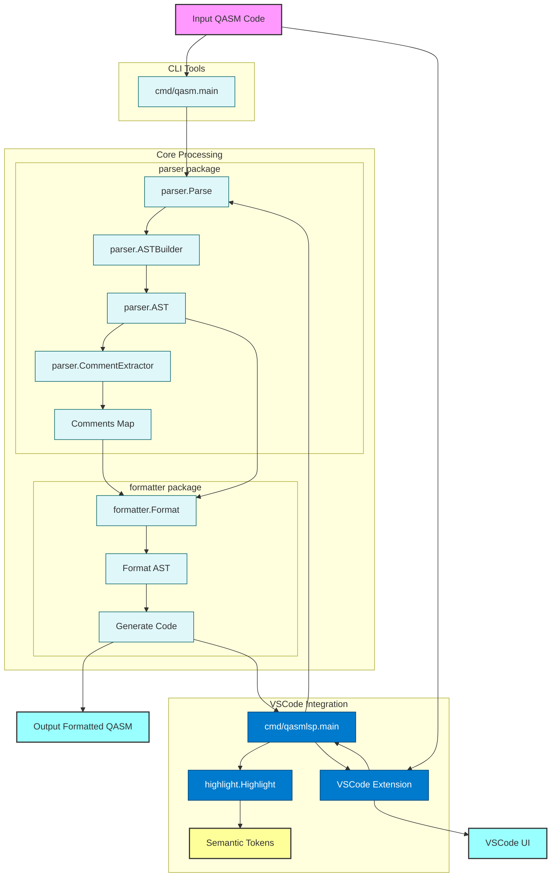

# QASM Tools


[](https://goreportcard.com/report/github.com/orangekame3/qasmtools)
[](https://opensource.org/license/apache-2-0/)

`qasmtools` is a comprehensive toolkit for OpenQASM 3.0 development, featuring a command-line interface (CLI) tool written in Go and a Visual Studio Code extension. It provides functionalities to parse, format, and highlight QASM files, making them more readable and consistent with enhanced development experience in VSCode.

## Features

* **QASM 3.0 Parsing**: Parses OpenQASM 3.0 files into an Abstract Syntax Tree (AST).
* **QASM 3.0 Formatting**: Formats QASM 3.0 files to adhere to a consistent style.
* **VSCode Extension**: Provides language support for OpenQASM 3.0 in Visual Studio Code with syntax highlighting, formatting, and Language Server Protocol (LSP) integration.

## Installation

To build `qasmtools` from source, ensure you have Go installed (version 1.16 or higher recommended).

1. Clone the repository:

    ```bash
    git clone https://github.com/orangekame3/qasmtools.git
    cd qasmtools
    ```

2. Build the executable:

    ```bash
    go build -o qasm ./cmd/qasm
    ```

    This will create an executable named `qasm` in the current directory.

## Usage

The `qasm` executable provides two main commands: `fmt` for formatting and `parse` for parsing QASM files.

### Formatting QASM Files

To format a QASM file:

```bash
qasm fmt [files...]
```

Options:

- `-w, --write`: Write result to (source) file instead of stdout
- `--check`: Check if files are formatted without modifying them
- `-i, --indent`: Set indentation size (default: 2)
- `-n, --newline`: Ensure files end with a newline (default: true)
- `-v, --verbose`: Enable verbose output
- `--diff`: Display diffs instead of rewriting files

Examples:

```bash
# Format a file and print to stdout
qasm fmt input.qasm

# Format multiple files in-place
qasm fmt -w file1.qasm file2.qasm

# Check if files are properly formatted
qasm fmt --check *.qasm

# Format with custom indentation
qasm fmt -i 4 input.qasm
```

### Parsing QASM Files

To parse and validate a QASM file:

```bash
qasm parse <file>
```

Example:

```bash
qasm parse input.qasm
```

## VSCode Extension

The `vscode-qasm` extension provides comprehensive OpenQASM 3.0 language support for Visual Studio Code.

### Features

* **Syntax Highlighting**: Rich syntax highlighting for OpenQASM 3.0 constructs
* **Code Formatting**: Automatic code formatting with `Shift+Alt+F` (Windows/Linux) or `Shift+Option+F` (Mac)
* **Semantic Tokens**: Advanced token-based highlighting for better code readability
* **Language Server Integration**: Real-time parsing and analysis through LSP

### Installation

#### From VSIX Package
1. Download the latest `.vsix` file from the releases
2. Install via VSCode Command Palette:
   ```
   Extensions: Install from VSIX...
   ```

#### Development Installation
```bash
# Navigate to the vscode-qasm directory
cd vscode-qasm

# Install dependencies and build
npm install

# Package the extension
npm run package

# Install the extension
code --install-extension vscode-qasm-*.vsix
```

### Usage

1. Open any `.qasm` or `.qasm3` file in VSCode
2. The extension will automatically activate and provide:
   - Syntax highlighting
   - Code formatting capabilities
   - Semantic token highlighting

### Development Commands

```bash
# Build and install the extension
task vscode:quick-cycle

# Debug the extension
task vscode:debug:extension

# Debug the LSP server
task vscode:debug:lsp

# View extension logs
task vscode:logs
```

## Project Structure

* `cmd/qasm/`: Contains the main entry point and CLI implementation
* `cmd/qasmlsp/`: Language Server Protocol (LSP) server for VSCode integration
* `parser/`: Handles the parsing of QASM 3.0 files and AST generation
  * `grammar/`: Contains the ANTLR grammar files for QASM 3.0
  * `gen/`: Contains generated parser code
* `formatter/`: Implements the QASM 3.0 formatting logic
* `highlight/`: Syntax highlighting implementation for LSP
* `vscode-qasm/`: VSCode extension for OpenQASM 3.0 language support
  * `syntaxes/`: TextMate grammar for syntax highlighting
  * `bin/`: Contains the embedded LSP server binary
* `examples/`: Contains example QASM files and usage examples
* `testdata/`: Contains test files for various QASM constructs

## Architecture

The following diagram illustrates the processing flow of qasmtools:



The diagram shows how QASM code flows through the system:

### CLI Flow

1. Input code enters through the cmd/qasm package
2. The parser package handles parsing and AST generation
3. Comments are extracted and maintained separately
4. The formatter package processes the AST and comments to generate formatted output

### VSCode Integration Flow

1. VSCode extension receives QASM files
2. LSP server (cmd/qasmlsp) provides language services
3. Syntax highlighting and semantic tokens enhance the editing experience
4. Formatting requests flow through the same formatter package
5. Real-time feedback is provided to the VSCode UI

## Examples

Check out the `examples/` directory for sample QASM files and usage examples:

　- `examples/bell_state.qasm`: Implementation of a Bell state
　- `examples/grover.qasm`: Implementation of Grover's algorithm
　- `examples/ast_visitor/`: Example of using the AST visitor
　- `examples/error_handling/`: Example of error handling
　- `examples/parse_simple/`: Simple parsing example

## Development

For development guidelines, please refer to [DEVELOPMENT.md](DEVELOPMENT.md).

## License

This project is licensed under the Apache License 2.0 - see the [LICENSE](LICENSE) file for details.

## Contributing

Contributions are welcome! Please feel free to submit a Pull Request. For major changes, please open an issue first to discuss what you would like to change.

Please make sure to update tests as appropriate and follow the existing code style.
