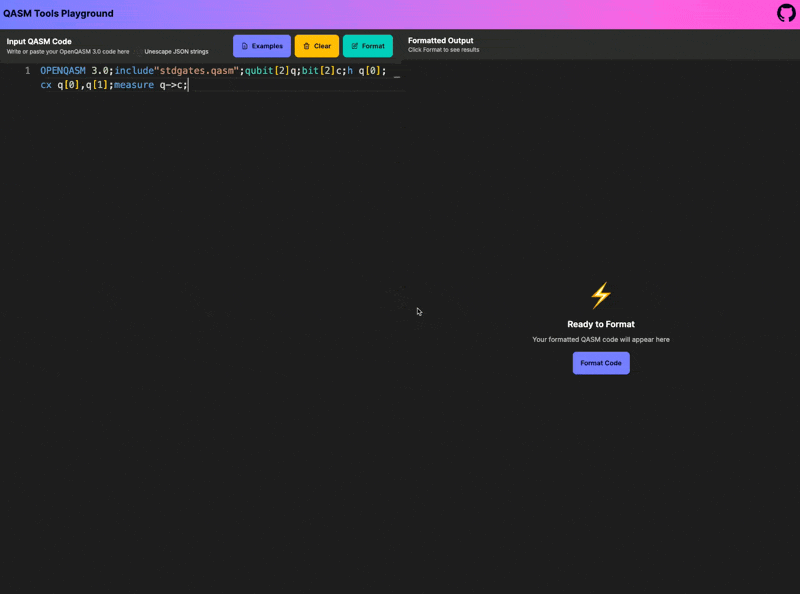

# QASM Tools


[](https://goreportcard.com/report/github.com/orangekame3/qasmtools)
[](https://opensource.org/license/apache-2-0/)

`qasmtools` is a comprehensive toolkit for OpenQASM 3.0 development, featuring a command-line interface (CLI) tool written in Go and a Visual Studio Code extension. It provides functionalities to parse, format, and highlight QASM files, making them more readable and consistent with enhanced development experience in VSCode.

## CLI Demo


## Features

* **QASM 3.0 Parsing**: Parses OpenQASM 3.0 files into an Abstract Syntax Tree (AST).
* **QASM 3.0 Formatting**: Formats QASM 3.0 files to adhere to a consistent style with support for standard input, JSON-style escaped strings, and automatic pipe detection.
* **QASM 3.0 Linting**: Checks QASM files for style and semantic issues using configurable YAML-based rules with documentation URLs for each violation, colored output, and JSON format support.
* **QASM 3.0 Highlighting**: Provides syntax highlighting for QASM files in the terminal with color-coded output for keywords, numbers, strings, and operators.
* **Pipeline Support**: All commands support stdin/stdout piping for seamless integration in command-line workflows.
* **Web Playground**: Interactive browser-based formatter with WebAssembly backend and unescape support.
* **VSCode Extension**: Provides language support for OpenQASM 3.0 in Visual Studio Code with syntax highlighting, formatting, and Language Server Protocol (LSP) integration.

## Installation

### Quick Install (macOS/Linux)

The easiest way to install `qasmtools` is with a single command:

```bash
curl -sSfL https://raw.githubusercontent.com/orangekame3/qasmtools/main/install.sh | sh
```

### Homebrew (macOS/Linux)

You can also install via Homebrew:

```bash
brew install orangekame3/tap/qasmtools
```

### Docker

You can use `qasmtools` via Docker without installing Go:

```bash
# Pull the image
docker pull ghcr.io/orangekame3/qasmtools:latest

# Format a QASM file
docker run --rm -v $(pwd):/workspace ghcr.io/orangekame3/qasmtools:latest fmt /workspace/input.qasm

# Lint a QASM file
docker run --rm -v $(pwd):/workspace ghcr.io/orangekame3/qasmtools:latest lint /workspace/input.qasm

# Interactive usage
docker run --rm -it -v $(pwd):/workspace ghcr.io/orangekame3/qasmtools:latest
```

### GitHub Actions

Use `qasmtools` in your CI/CD pipeline:

```yaml
name: QASM Quality Check

on: [push, pull_request]

jobs:
  qasm-check:
    runs-on: ubuntu-latest
    steps:
      - uses: actions/checkout@v4
      
      - name: Install qasmtools
        run: |
          curl -sSfL https://raw.githubusercontent.com/orangekame3/qasmtools/main/install.sh | sh
          echo "$HOME/.local/bin" >> $GITHUB_PATH
      
      - name: Format check
        run: |
          qasm fmt --check *.qasm
      
      - name: Lint check
        run: |
          qasm lint *.qasm
```

Multi-platform testing:

```yaml
name: QASM Quality Check

on: [push, pull_request]

jobs:
  qasm-check:
    strategy:
      matrix:
        os: [ubuntu-latest, macos-latest]
    runs-on: ${{ matrix.os }}
    steps:
      - uses: actions/checkout@v4
      
      - name: Install qasmtools
        run: |
          curl -sSfL https://raw.githubusercontent.com/orangekame3/qasmtools/main/install.sh | sh
          echo "$HOME/.local/bin" >> $GITHUB_PATH
      
      - name: Format check
        run: |
          qasm fmt --check *.qasm
      
      - name: Lint check
        run: |
          qasm lint *.qasm
```

Alternative using Docker:

```yaml
name: QASM Quality Check

on: [push, pull_request]

jobs:
  qasm-check:
    runs-on: ubuntu-latest
    steps:
      - uses: actions/checkout@v4
      
      - name: Format check
        run: |
          docker run --rm -v ${{ github.workspace }}:/workspace ghcr.io/orangekame3/qasmtools:latest fmt --check /workspace/*.qasm
      
      - name: Lint check
        run: |
          docker run --rm -v ${{ github.workspace }}:/workspace ghcr.io/orangekame3/qasmtools:latest lint /workspace/*.qasm
```

### Build from Source

To build `qasmtools` from source, ensure you have Go installed (version 1.16 or higher recommended).

1. Clone the repository:

    ```bash
    git clone https://github.com/orangekame3/qasmtools.git
    cd qasmtools
    ```

2. Build the executable:

    ```bash
    go build -o qasm ./cmd/qasm
    ```

    This will create an executable named `qasm` in the current directory.

## Usage

The `qasm` executable provides three main commands: `fmt` for formatting, `lint` for linting, and `highlight` for syntax highlighting of QASM files.

### Formatting QASM Files

To format a QASM file:

```bash
qasm fmt [files...]
```

Options:

- `-w, --write`: Write result to (source) file instead of stdout
- `--check`: Check if files are formatted without modifying them
- `-i, --indent`: Set indentation size (default: 2)
- `-n, --newline`: Ensure files end with a newline (default: true)
- `-v, --verbose`: Enable verbose output
- `--diff`: Display diffs instead of rewriting files
- `--stdin`: Read input from stdin instead of files
- `--unescape`: Unescape JSON-style escaped strings (\\n, \\") before formatting

Examples:

```bash
# Format a file and print to stdout
qasm fmt input.qasm

# Format multiple files in-place
qasm fmt -w file1.qasm file2.qasm

# Check if files are properly formatted
qasm fmt --check *.qasm

# Format with custom indentation
qasm fmt -i 4 input.qasm

# Format from standard input (automatic detection)
echo "OPENQASM 3.0;qubit q;h q;" | qasm fmt

# Format from standard input (explicit)
echo "OPENQASM 3.0;qubit q;h q;" | qasm fmt --stdin

# Format escaped JSON strings
printf '"OPENQASM 3.0;\\nqubit q;\\nh q;"' | qasm fmt --stdin --unescape

# Format complex escaped strings with includes
printf '"OPENQASM 3.0;\\ninclude \\"stdgates.inc\\";\\nqubit[2] q;\\nh q[0];"' | qasm fmt --stdin --unescape

# Format escaped content from file
qasm fmt --unescape escaped_file.qasm
```

### Linting QASM Files

To check QASM files for style and semantic issues:

```bash
qasm lint [files...]
```

Options:

- `--rules`: Directory containing custom rule files (default: use embedded rules)
- `-d, --disable`: Disable specific rules (e.g., QAS001,QAS002)
- `-e, --enable-only`: Enable only specific rules
- `--format`: Output format (text, json)
- `-q, --quiet`: Suppress info and warning messages

Examples:

```bash
# Lint a single file
qasm lint input.qasm

# Lint multiple files
qasm lint *.qasm

# Disable specific rules
qasm lint --disable=QAS001,QAS003 input.qasm

# Enable only specific rules
qasm lint --enable-only=QAS002 input.qasm

# Use custom rules directory
qasm lint --rules=custom/rules input.qasm

# Pipe input from stdin (automatic detection)
cat input.qasm | qasm lint

# Explicit stdin input
qasm lint --stdin < input.qasm

# Disable colored output
qasm lint --no-color input.qasm

# JSON output format
qasm lint --format=json input.qasm

# Pipeline example: format then lint
cat messy.qasm | qasm fmt | qasm lint
```

#### Built-in Rules

The linter includes 12 comprehensive built-in rules to ensure code quality and correctness:

**Semantic Analysis:**
- **QAS001** `unused-qubit` - Detects qubits that are declared but never used in gates or measurements
- **QAS002** `undefined-identifier` - Error when using undeclared variables, functions, or gates
- **QAS003** `constant-measured-bit` - Warning when measuring qubits with no gates applied (result always |0⟩)
- **QAS004** `out-of-bounds-index` - Error when using out-of-bounds indices on arrays or registers
- **QAS006** `gate-register-size-mismatch` - Error when quantum register lengths do not match in gate calls
- **QAS007** `gate-parameter-indexing` - Error when using index access on gate parameters (prohibited)
- **QAS008** `qubit-declared-in-local-scope` - Error when declaring qubits in local scope (functions, gates, blocks)
- **QAS009** `illegal-break-continue` - Error when using break or continue outside of loops
- **QAS010** `invalid-instruction-in-gate` - Error when including non-unitary operations in gate definitions
- **QAS011** `reserved-prefix-usage` - Error when using reserved prefix (__) in identifiers

**Style and Conventions:**
- **QAS005** `naming-convention-violation` - Warning for violations of OpenQASM naming conventions
- **QAS012** `snake-case-required` - Warning to enforce snake_case naming for identifiers

Each rule violation includes a documentation URL for detailed explanations and examples.

#### Output Example

```
input.qasm:5:7: warning [QAS001] Qubit 'unused_qubit' is declared but never used. (https://github.com/orangekame3/qasmtools/blob/main/docs/rules/QAS001.md)
input.qasm:8:12: error [QAS002] Identifier 'undefined_gate' is not declared. (https://github.com/orangekame3/qasmtools/blob/main/docs/rules/QAS002.md)
input.qasm:10:3: error [QAS004] Index out of bounds: accessing '2' on 'q' of length 2. (https://github.com/orangekame3/qasmtools/blob/main/docs/rules/QAS004.md)

📊 Found 3 issues: 2 errors, 1 warnings, 0 info
```

#### Rule Documentation

Detailed documentation for each rule is available at [docs/rules/](docs/rules/README.md) with examples and explanations.

## Web Playground

The QASM Tools Playground provides an interactive web-based environment for formatting OpenQASM 3.0 code directly in your browser.

### Features

* **Real-time Formatting**: Format QASM code instantly with the same engine used by the CLI
* **Unescape Support**: Handle JSON-style escaped strings (\\n, \\") with a simple checkbox
* **Sample Code**: Quick access to example QASM programs for testing and learning
* **Syntax Highlighting**: Monaco Editor integration with custom QASM language support
* **WebAssembly Backend**: Powered by the same Go formatter compiled to WASM for consistency



### Usage

1. Navigate to the playground web interface
2. Enter or paste your QASM code in the input panel
3. Enable "Unescape JSON strings" if your input contains escaped characters
4. Click "Format" to see the formatted output
5. Use "Copy" to copy the formatted result to clipboard

### Examples

The playground supports the same functionality as the CLI:

```qasm
// Input (unformatted)
OPENQASM 3.0;include"stdgates.inc";qubit[2]q;h q[0];cx q[0],q[1];

// Output (formatted)
OPENQASM 3.0;
include "stdgates.inc";

qubit[2] q;
h q[0];
cx q[0], q[1];
```

### Development

```bash
# Setup playground development environment
task playground:setup

# Start development server with WASM
task playground:dev

# Build for production
task playground:build
```

### Highlighting QASM Files

To display QASM files with syntax highlighting in the terminal:

```bash
qasm highlight [file]
```

Examples:

```bash
# Highlight a file
qasm highlight input.qasm

# Highlight from stdin (automatic detection)
cat input.qasm | qasm highlight

# Explicit stdin input
qasm highlight --stdin < input.qasm

# Pipeline example: format then highlight
echo "OPENQASM 3.0;qubit q;h q;" | qasm fmt | qasm highlight
```

The highlight command provides colorized output with:
- **Keywords** in yellow (OPENQASM, include, qubit, etc.)
- **Numbers** in cyan  
- **Strings** in green
- **Operators** in white

## VSCode Extension

The `vscode-qasm` extension provides comprehensive OpenQASM 3.0 language support for Visual Studio Code.

### Features

* **Syntax Highlighting**: Rich syntax highlighting for OpenQASM 3.0 constructs
* **Code Formatting**: Automatic code formatting with `Shift+Alt+F` (Windows/Linux) or `Shift+Option+F` (Mac)
* **Semantic Tokens**: Advanced token-based highlighting for better code readability
* **Language Server Integration**: Real-time parsing and analysis through LSP
* **Built-in Linting**: Powered by the same YAML-based rule engine as the CLI tool

### Installation

#### From Visual Studio Code Marketplace
1. Visit the [VSCode Marketplace](https://marketplace.visualstudio.com/items?itemName=orangekame3.vscode-qasm)
2. Click "Install" to add the extension to VSCode
3. Alternatively, search for "OpenQASM 3.0" in the VSCode Extensions view (`Ctrl+Shift+X`)

#### From VSIX Package
1. Download the latest `.vsix` file from the releases
2. Install via VSCode Command Palette:
   ```
   Extensions: Install from VSIX...
   ```

#### Development Installation
```bash
# Navigate to the vscode-qasm directory
cd vscode-qasm

# Install dependencies and build
npm install

# Package the extension
npm run package

# Install the extension
code --install-extension vscode-qasm-*.vsix
```

### Usage

1. Open any `.qasm` or `.qasm3` file in VSCode
2. The extension will automatically activate and provide:
   - Syntax highlighting
   - Code formatting capabilities
   - Semantic token highlighting

### Demonstration

#### Syntax Highlighting Example


#### Code Formatting Example


#### Linting Example


### Development Commands

```bash
# Build and install the extension
task vscode:quick-cycle

# Debug the extension
task vscode:debug:extension

# Debug the LSP server
task vscode:debug:lsp

# View extension logs
task vscode:logs
```

## Project Structure

* `cmd/qasm/`: Contains the main entry point and CLI implementation
* `cmd/qasmlsp/`: Language Server Protocol (LSP) server for VSCode integration
* `cmd/wasm/`: WebAssembly build target for the playground
* `parser/`: Handles the parsing of QASM 3.0 files and AST generation
  * `grammar/`: Contains the ANTLR grammar files for QASM 3.0
  * `gen/`: Contains generated parser code
* `formatter/`: Implements the QASM 3.0 formatting logic
* `lint/`: QASM 3.0 linting engine with YAML-based rules
  * `rules/`: Built-in rule definitions (QAS001-QAS012) with documentation URLs, specification URLs, and examples
  * `runner.go`: Core linter engine and rule execution
  * `rule.go`: Rule definitions, violation structures, and checker interfaces
  * `factory.go`: Rule checker factory for creating specific rule implementations
* `highlight/`: Syntax highlighting implementation for LSP
* `playground/`: Web-based QASM formatter with WebAssembly backend
  * `src/`: React/TypeScript frontend components
  * `public/`: Static assets (WASM files are generated during build)
* `vscode-qasm/`: VSCode extension for OpenQASM 3.0 language support
  * `syntaxes/`: TextMate grammar for syntax highlighting
  * `bin/`: Contains the embedded LSP server binary
* `examples/`: Contains example QASM files and usage examples
* `testdata/`: Contains test files for various QASM constructs

## Architecture

The following diagram illustrates the processing flow of qasmtools:


The diagram shows how QASM code flows through the system:

### CLI Flow

1. Input code enters through the cmd/qasm package
2. The parser package handles parsing and AST generation
3. Comments are extracted and maintained separately
4. The formatter package processes the AST and comments to generate formatted output

### VSCode Integration Flow

1. VSCode extension receives QASM files
2. LSP server (cmd/qasmlsp) provides language services
3. Syntax highlighting and semantic tokens enhance the editing experience
4. Formatting requests flow through the same formatter package
5. Real-time feedback is provided to the VSCode UI

### Web Playground Flow

1. Browser UI receives QASM code input from users
2. Code is processed by the WebAssembly build (cmd/wasm.main)
3. WebAssembly Go runtime executes the same formatting logic as CLI/LSP
4. Formatted output is returned to the browser for display
5. Same core parser and formatter packages ensure consistency across all platforms

### Linting Flow

1. AST and Comments from parser package are fed into the lint.Linter
2. Linter loads YAML-based rule definitions (QAS001-QAS012)
3. Rule checkers analyze AST nodes for style and semantic violations
4. Violations are generated with file positions, severity levels, documentation URLs, and specification URLs
5. Output is formatted as colored text or JSON for CLI consumption
6. In VSCode, violations are converted to LSP diagnostics for real-time display

## Examples

Check out the `examples/` directory for sample QASM files and usage examples:

　- `examples/bell_state.qasm`: Implementation of a Bell state
　- `examples/grover.qasm`: Implementation of Grover's algorithm
　- `examples/ast_visitor/`: Example of using the AST visitor
　- `examples/error_handling/`: Example of error handling
　- `examples/parse_simple/`: Simple parsing example

## Development

For development guidelines, please refer to [DEVELOPMENT.md](DEVELOPMENT.md).

### Testing

The project includes comprehensive test coverage for all components:

```bash
# Run all tests
task test

# Run tests with coverage
task test:coverage

# Run specific component tests
go test ./cmd/qasm -v          # CLI functionality tests
go test ./formatter -v         # Formatter tests (including unescape)
go test ./lint -v             # Linting engine tests
go test ./highlight -v        # Syntax highlighting tests

# Integration tests
go test ./cmd/qasm -run TestUnescapeIntegration -v
go test ./cmd/qasm -run TestFileUnescapeIntegration -v
```

Test coverage includes:
- Unit tests for all core functionality
- Integration tests for CLI commands with real binary execution
- Formatter idempotency tests
- Edge cases for unescape functionality
- Error handling and validation

## License

This project is licensed under the Apache License 2.0 - see the [LICENSE](LICENSE) file for details.

## Contributing

Contributions are welcome! Please feel free to submit a Pull Request. For major changes, please open an issue first to discuss what you would like to change.

Please make sure to update tests as appropriate and follow the existing code style.
